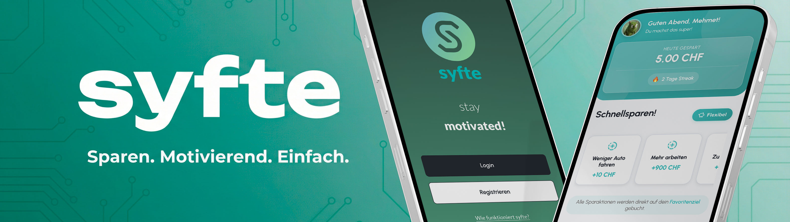

# 📚 Projekt-Dokumentation

## 📑 Inhaltsverzeichnis

- [Funktionsumfang](#-funktionsumfang)
- [Features](#-features)
- [Tech-Stack](#-tech-stack)
- [Datenbankstruktur](#-datenbankstruktur)
- [Known Bugs](#-known-bugs)
- [Projektlearnings](#-projektlearnings)
- [Reflexion](#-reflexion)
- [Weiterführende Dokumentation](#-weiterführende-dokumentation)

---

## 🎯 Funktionsumfang

### Was kann das Tool?

**Syfte** ist eine Progressive Web App für motivierendes Sparen mit folgenden Hauptfunktionen:

#### 1. Sparziele-Management
- **Sparziele erstellen**: Individuelle Ziele mit Titel, Zielbetrag und optionalem Bild
- **Fortschritts-Tracking**: Visuelle Fortschrittsbalken und Prozentanzeige
- **Favoriten**: Ein Sparziel als Favorit markieren für Quick-Access
- **Ziel-Archivierung**: Abgeschlossene Ziele können gelöscht werden

#### 2. Sparaktionen
- **Vordefinierte Aktionen**: Eigene Sparaktionen erstellen (z.B. "Kaffee ausgelassen", "Take-away verzichtet")
- **Quick Save**: Schnelles Hinzufügen von Ersparnissen zum Favoriten-Ziel
- **Detailliertes Tracking**: Notizen zu jedem Sparvorgang optional möglich
- **Action-Zuordnung**: Jeder Sparvorgang kann einer Aktion zugeordnet werden

#### 3. Gamification
- **Streak-System**: Tägliche Spar-Serien werden getrackt (current & longest streak)
- **Streak-Popup**: Motivierende Anzeige nach dem ersten Sparvorgang des Tages
- **Wochenübersicht**: Visuelle Darstellung der gespeicherten Tage (Mo-So)
- **Achievements**: System für Auszeichnungen und Meilensteine (Datenbank-ready)

#### 4. Soziale Features
- **Freundschaften**: Freunde hinzufügen via Benutzername-Suche
- **Freundschaftsanfragen**: Pending/Accept/Decline System

#### 5. Analytics & Export
- **Datenexport**: CSV/JSON Export von Transaktionen und Zielen
- **Statistiken**: Gesamtersparnis über alle Ziele hinweg
- **Visualisierungen**: ApexCharts für Spar-Trends (implementiert in SavingsChart.vue)

#### 6. Account & Security
- **Login**: Via Passwort und Benutzername/Email
- **Profilverwaltung**: Profilbild, Name, Username, E-Mail anpassbar
- **Passwort-Änderung**: Sicheres Update mit PBKDF2 Hashing
- **Account-Löschung**: Komplette Datenlöschung möglich

#### 7. Progressive Web App
- **Installierbar**: Auf Home-Screen installierbar (iOS & Android)
- **Offline-Support**: Service Worker mit Caching-Strategien
- **Responsive Design**: Optimiert für alle Bildschirmgrössen
- **iOS-Optimierung**: Safe Area Insets, Notch-Support, Home-Indicator Handling

### Wie macht es das?

#### Technische Architektur

---

## ✨ Features

- 🎯 **Individuelle Sparziele** mit Echtzeit-Fortschritt
- 💰 **Vordefinierte Sparaktionen** für schnelles Tracking
- 🏆 **Achievements & Streaks** für Gamification
- 👥 **Freundschaften** für soziales Sparen
- 📊 **Analytics & Datenexport** (CSV/JSON)
- 🔐 **Einfaches Login** Passwort OAuth
- 📱 **PWA** mit Offline-Support und App-Installation

---

## 🛠 Tech Stack

**Frontend (Vue 3 + Nuxt 4)**
- **Pages-basiertes Routing**: Nuxt Auto-Routing für SPA-Navigation
- **Composition API**: Moderne Vue-Syntax mit `setup()` und Composables
- **State Management**: Lokaler State + API-Calls, keine externe Store-Library
- **Reactive Data**: Vue's Reactivity System für Echtzeit-UI-Updates

**Backend (Nuxt Server API)**
- **API Routes**: RESTful API unter `/server/api/`
- **Middleware**: Auth-Middleware für geschützte Endpunkte
- **Drizzle ORM**: Type-safe Datenbankzugriff
- **JWT Authentication**: Session-Management mit HTTP-only Cookies

**Datenbank (MariaDB)**
- **Relationale Struktur**: Normalisierte Tabellen mit Foreign Keys
- **Automatische Aggregation**: Daily aggregates für Analytics
- **Trigger & Constraints**: DB-seitige Validierung und Konsistenz

**Security**
- **Input Validation**: Schema-basierte Validierung in `server/utils/validation.ts`
- **Password Hashing**: PBKDF2 mit Salt (10.000 Iterationen)
- **Security Headers**: CSP, XSS-Protection, Frame-Options via Nitro
- **Rate Limiting**: Memory-basiert (Development), Redis-ready für Production

**Streak-Tracking**
- **Automatische Updates**: Bei jedem Sparvorgang in `add-with-action.post.ts`
- **Date-Comparison**: `isSameDay()` Helper für Streak-Kontinuität
- **Cookie-basierte UI-States**: Popup nur einmal pro Tag anzeigen
- **Midnight-Reset**: Cookies laufen um 00:00 Uhr ab

**PWA Features**
- **Workbox**: Service Worker für Offline-Caching
- **Manifest**: App-Name, Icons, Theme-Color, Display-Mode
- **Install-Prompt**: Custom Composable `usePwaInstall()` für Install-Button

- **Live**: [syfte.ch](https://www.syfte.ch)
---

## 📊 Datenbankstruktur

Haupttabellen (vollständiges Schema in [`db/syfte.sql`](db/syfte.sql)):

| Tabelle | Beschreibung |
|---------|-------------|
| `users` | Benutzerprofile mit Gesamtersparnis |
| `goals` | Sparziele mit Fortschritt & Sharing |
| `savings` | Einzelne Sparvorgänge (Transaktionen) |
| `achievements` | Auszeichnungen & Meilensteine |
| `streaks` | Spar-Serien Tracking |
| `friendships` | Soziales Netzwerk |

---

## 🐛 Known Bugs

### Performance-Probleme
- **⚠️ Lange Ladezeiten in Live-Umgebung**: Die App zeigt in der Production-Umgebung (syfte.ch) deutlich längere Ladezeiten als im Development-Modus. Mögliche Ursachen:
  - Datenbankverbindung zu langsam (Netzwerk-Latenz)
  - Fehlende Server-seitige Caching-Strategien
  - Nicht optimierte Datenbankabfragen (fehlende Indizes)
  - Service Worker Caching-Strategie nicht optimal konfiguriert
  - Grosse Asset-Dateien ohne Kompression

**Geplante Lösungen:**
- Redis-Caching für API-Responses implementieren
- Datenbankabfragen optimieren mit Indizes
- CDN für statische Assets einrichten
- Server-Side Rendering (SSR) optimieren

---

## 💡 Projektlearnings

### 1. Dashboard & Sparziele-Anzeige
**Problem**: Sparziele wurden im Dashboard nicht angezeigt, obwohl sie in der Datenbank existierten.

**Ursache**: Die API `/api/goals/index` verwendet einen `LEFT JOIN` mit der `savings`-Tabelle. Bei neuen Zielen ohne Sparvorgänge resultieren NULL-Werte, die nicht korrekt behandelt wurden.

**Lösung**: Das Dashboard nutzt jetzt die separate `/api/dashboard` API, die Ziele direkt aus der `goals`-Tabelle lädt ohne JOIN-Abhängigkeit.

**Learning**: Bei JOIN-Abfragen immer auf NULL-Werte prüfen, besonders bei optionalen Beziehungen.

---

### 2. API-Parameter-Konsistenz
**Problem**: "Aktion erstellt, aber konnte nicht zugewiesen werden" Fehler beim Erstellen von Sparaktionen.

**Ursache**: API erwartet `actionId` (singular), aber Frontend sendet `actionIds` (plural Array).

**Lösung**: Parameter korrigiert zu `actionId: response.action.id` im Frontend.

**Learning**: API-Schemas genau prüfen - Singular vs. Plural bei Parametern kann subtile Bugs verursachen.

---

### 3. Dynamische Routing-Struktur
**Erkenntnis**: Nuxt 4 Pages-System ermöglicht `pages/goals/[id].vue` → `/goals/:id` automatisch.

**Implementierung**: Vollständige Sparziel-Detailseite mit allen CRUD-Operationen ohne manuelle Route-Registrierung.

**Best Practice**: Route-Parameter mit `useRoute()` und `route.params.id` auslesen.

**Learning**: Konsistente Namenskonvention bei API-Endpunkten und Routes einhalten (`/api/goals/[id]` matched `/goals/:id`).

---

### 4. Frontend-Backend-Datenfluss
**Muster**: Frontend lädt Daten → zeigt sie an → Benutzer-Interaktion → API-Aufruf → Daten-Refresh.

**Beispiel**: Sparaktion erstellen → `/api/actions/create` → `/api/goals/[id]/actions` → Detailseite neu laden.

**Learning**: Immer nach erfolgreichen Mutationen die relevanten Daten neu laden für UI-Konsistenz.

---

### 5. Streak-System & Automatisches Tracking
**Implementierung**: `server/utils/streaks.ts` mit `updateUserStreak()` und `getCurrentStreak()`.

**Logik**: Automatische Streak-Aktualisierung bei jedem Sparvorgang in `add-with-action.post.ts`.

**Date-Handling**: Vergleich mit `isSameDay()` Helper für Streak-Kontinuität:
- Gestern = +1 (Streak erhöhen)
- Heute = gleich (Streak beibehalten)
- Sonst = Reset auf 1

**DB-Felder**: `current_count`, `longest_count`, `last_save_date` in `streaks` Tabelle.

**Learning**: Streak-Update NACH erfolgreicher Transaktion, damit keine inkonsistenten Daten entstehen.

---

### 6. Goal Completion & Business Logic
**Completion Check**: `savedChf >= targetChf` definiert abgeschlossene Ziele.

**Backend Validation**: `/api/savings/add-with-action` wirft Error 400 bei Saving zu completed goals.

**Frontend Filtering**: Dashboard filtert aktive Ziele: `goals.filter(g => !g.isCompleted)` für Quick Save.

**UI-Feedback**:
- Grüner Badge "Erreicht!" mit Check-Icon
- Erfolgs-Message mit Confetti-Emoji 🎉
- Lösch-Button (roter Trash-Icon) nur bei completed goals
- Fortschrittsbalken limitiert auf `Math.min(100, percentage)` - niemals über 100%

**User Flow**: Completed Goal → Anzeige mit Success-UI → Löschen möglich → Redirect zu Dashboard.

**Learning**: Business Logic (Completion Check) im Backend UND Frontend synchron halten.

---

### 7. Streak-Popup & Cookie-basiertes Tracking
**Implementierung**: `StreakPopup.vue` Component mit Flamme, Zahl, Wochenansicht (Mo-So) und glücklichem Schaf.

**Design**:
- Flamme (140x265px) hinter der Zahl via absolute positioning und z-index layering
- Zahl: 120px, weiss mit 5px türkiser Kontur (`-webkit-text-stroke`)
- Lucide Icons (CheckCircle2, Circle) für gespeicherte/nicht gespeicherte Tage
- Responsive Design für 414px und 360px Breakpoints

**Popup-Logik**:
- Wird nur beim **ersten Sparvorgang des Tages** angezeigt
- Cookie `streak_popup_shown_{userId}` verhindert mehrfache Anzeige
- Cookie läuft um Mitternacht ab (expires tomorrow 00:00:00)
- API `/api/streaks/check-new` prüft Cookie und gibt `showPopup: boolean` zurück

**Wochenansicht**:
- `/api/streaks/current` liefert `weekData: boolean[7]` für aktuelle Woche (Mo-So)
- Berechnung mit Montags-Offset: `todayDayOfWeek === 0 ? -6 : 1 - todayDayOfWeek`

**Learning**: Cookie-basiertes Session-Tracking effektiv für tägliche UI-State-Verwaltung.

---

## 🤔 Reflexion

### Technische Herausforderungen

Die grösste Herausforderung war definitiv, **alle Komponenten zum Laufen zu bringen**: Datenbank auf dem Webhosting-Server, Nuxt lokal, Domainregistration extern und das Deployment auf Vercel. Zusätzlich war das initiale Aufsetzen der `copilot_instructions` und das Abstimmen mit unseren Projektvorgaben aufwändiger als gedacht.

Am meisten zu kämpfen hatten wir mit der Implementierung des **Streak- und Achievement-Systems** – die Logik für das tägliche Tracking und die Cookie-basierte Popup-Anzeige war komplex. Auch die KI-Unterstützung stiess hier an Grenzen: Wenn die monatlichen Copilot-Credits aufgebraucht waren, mussten wir auf andere Modelle ausweichen, was zeitweise ein Risiko für die Codequalität darstellte und erhöhte Aufmerksamkeit erforderte.

Eine zentrale Erkenntnis war, dass **Frontend und Backend in einem Nuxt-Projekt** unglaublich praktisch sind. Wir haben viel darüber gelernt, wie Branches funktionieren, wie das PWA-Modul integriert wird und wie effizient das Arbeiten mit dem Entwicklungsserver ist. Auch der „Deep Dive“ in Vercel war sehr lehrreich.

Rückblickend würden wir die **Datenbankstruktur anders angehen**. Die Datenbank war ein wilder Ritt – für das nächste Projekt macht es Sinn, nicht einfach drauf los zu schiessen, sondern Tabelle für Tabelle genau zu planen, um keine "eierlegende Wollmilchsau" zu bauen. Die grösste **"Aha!"-Erkenntnis** kam mit dem **unteren Navigationsmenü**: Es machte die UX und die Code-Architektur plötzlich viel strukturierter.

### Projektmanagement & Workflow

Die **Zusammenarbeit im Team** lief hervorragend. Wir haben uns perfekt ergänzt (Design/Frontend und Backend/API) und sind uns praktisch nie in die Quere gekommen. Unsere Projektplanung war absolut realistisch; wir wussten von Anfang an, was das Ziel ist. Auch der Workflow zwischen VS Code, GitHub und Vercel funktionierte reibungslos.

Zeitlich war es gegen Ende etwas unausgeglichen, da Claudio mehr Aufgaben übernahm, während Adrian weniger Zeit hatte. Dennoch sind wir über das ganze Semester hinweg als Team drangeblieben, was entscheidend für den Erfolg war. **GitHub Copilot** hat uns – trotz der Credit-Engpässe – enorm viel Zeit bei repetitiven Tasks und beim Debugging gespart.

Beim nächsten Projekt würden wir gerne eine ausgewogenere Zeitverteilung anstreben und technologisch neue Wege gehen, beispielsweise durch den Einsatz von **Supabase oder erweiterten KI-Funktionen**, um noch mehr neue Learnings zu generieren.

### Persönliche Entwicklung

Wir haben gelernt, eine **Full-Stack Web-App/PWA von A bis Z zu entwickeln**. Wir fühlen uns nun deutlich sicherer im Umgang mit Nuxt und der gesamten Umgebung eines Entwicklungsservers. Es war motivierend, live zu sehen, wie die App wächst und immer mehr Funktionen hinzukommen.

Am meisten Spass gemacht hat das **gemeinsame Problemlösen und Designen**. Wir mussten nicht "einfach drauf los programmieren", sondern konnten unsere klare Design-Vorstellung exakt umsetzen. Wenn das Ergebnis dann genau so aussah wie geplant, war das ein Highlight.

Frustrierend war hingegen das **Debugging**, bis Funktionen fehlerfrei liefen, sowie die Tatsache, dass **unsere Datenbank im Eduroam oft nicht erreichbar war**. Das zwang uns zu Workarounds wie Hotspots.

Mit dem Endergebnis sind wir sehr zufrieden: **9/10**. Die App funktioniert stabil, sieht gut aus und kann genau so eingesetzt werden, wie wir uns das vorgestellt haben. Ein paar Features mehr (z.B. erweiterte Analytics) wären cool gewesen, aber für den gegebenen Zeitrahmen sind wir stolz auf das Resultat.

### Unser Vorgehen

Ganz zu Beginn haben wir uns natürlich andere Apps angeschaut, um zu sehen, wie diese aufgebaut sind, und haben die für uns wichtigsten Elemente herausgenommen. Zusammen bauten wir dann in Figma einen einfachen Prototypen, der unseren geplanten Ablauf so korrekt wie möglich simulierte. Dieser Prototyp ist über die Zeit gewachsen und hat sich designtechnisch weiterentwickelt, damit wir für die spätere Umsetzung genau wussten, wie die Dinge aussehen sollen.

Auch für die Backend-Logik haben wir uns in Figma die Abläufe und Zusammenhänge genau überlegt und notiert. Als Grundstruktur für unser Backend liessen wir uns anschliessend von ChatGPT ein ER-Modell zusammenstellen.

Als wir mit dem Programmieren anfingen, startete Adrian direkt mit der API-Logik im Backend, während Claudio mit den ersten Frontend-Arbeiten gemäss unserem Figma-Designkonzept begann. Wir konnten während des ganzen Prozesses sehr gut "nebeneinanderher" programmieren und sind uns fast nie in die Quere gekommen, weil wir uns super abgesprochen haben. Die Aufgaben waren klar verteilt: Adrian kümmerte sich um Backend und Logik, Claudio hauptsächlich um UX/UI. Während der Arbeit haben wir den aktuellen Stand immer wieder direkt auf dem Smartphone getestet, bewertet und besprochen.

---

## 📖 Weiterführende Dokumentation

- **[API-Dokumentation](./API-Dokumentation.md)** - Vollständige REST API Referenz
- **[Designkonzept](./Designkonzept.md)** - Farbschema, Typography, UI-Guidelines
- **[Figma Prototyp](https://www.figma.com/design/tLgaFKFXHePoBy6zYofs0O/syfte?node-id=0-1&t=opJbfwejTINKTlzI-1)** - UI-Design, Prototyping
- **[Sicherheitskonzept](../Anleitungen/Sicherheitsimplementierungen.md)** - Security Features & Best Practices
- **[Coding Guidelines](../.github/copilot-instructions.md)** - Projekt-spezifische Entwicklerrichtlinien

---

**Dokumentationsversion**: 1.0  
**Letzte Aktualisierung**: 7. Januar 2026  
**Autoren**: Adrian Janka, Claudio Riz
